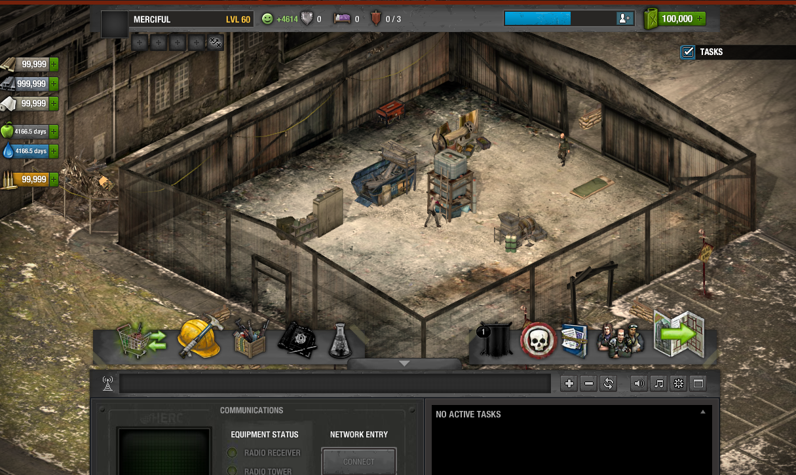
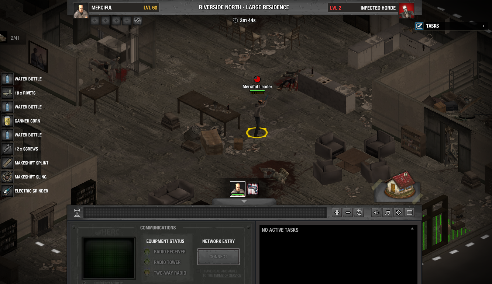

# Dead Zone Server




Server emulator for Dead Zone.

This project is intentionally not finished and is already abandoned. This repository is only an archive.

_This project tries to reconstruct the game server-side behavior. Client files and assets are not included. This project is not official and is not associated with the original creators._

Made with [Encore](https://github.com/glennhenry/Encore).

# Server Manual

This guide assumes default settings set from the `venue.xml` file.

## Requirements

- **Java 25+**
- **MongoDB v8.0+**
- **Node v18.20.8 or v20.3.0, v22.0.0+** (only for docs)

## Setup

To run the server, ensure MongoDB is running on `mongodb://localhost:27017`. Then, run the following command:

```bash
.\gradlew run
```

- File and API server runs on `127.0.0.1:8080`
- Socket server runs on `127.0.0.1:7777`

You can also run the server from IntelliJ IDE run plugin on `Application.kt`.

## Build

To build the server, simply run the `build.bat/sh` script. Output will be in `deploy/`. Run the deployment server using `java -jar encore.jar`.

For manual build:

```bash
.\gradlew shadowJar
```

Server will be available on the same port as development mode. The documentation website, if built, will be available on `127.0.0.1:8080/docs`.

## Configuration

Various server settings can be configured from `venue.xml`. Secret version of the variables can be set from `venue.secret.xml`.

Every variables can be overriden from OS environment variables. For example, in PowerShell (Windows):

```ps1
$env:ENCORE_DEV_MODE = "false"
$env:ENCORE_SERVER_PORT = "1234"
java -jar encore.jar
```

More information in [Venue.kt](https://github.com/glennhenry/Encore/blob/main/src/main/kotlin/encore/venue/Venue.kt)

## Docs

Empty documentation template ([built with Starlight](https://starlight.astro.build/), based on [sl-obsidian-starter](https://github.com/glennhenry/sl-obsidian-starter)) is available on `docs/`

To run the website locally on development mode:

```bash
cd docs
npm install
npm run dev
```

Docs runs on `http://localhost:4321/docs`.

For more info on setup and configuration, please see
the [official Starlight documentation](https://starlight.astro.build/getting-started/).

### How to add new page:

1. A page must be `.md` file and is enforced to have this on top of them (frontmatter):

```
---
title: Subfolder Example
slug: folderA/folderB/example
description: example
---
```

2. Replace the title appropriately. The description is optional; you can set it to be the same as the title. Any images or videos should be placed in `src/assets/`.
3. The slug is produced from the directory structure. For instance, this page is named `example.md` and is under the `folderB` within the `folderA`.
4. Next, add the page to the sidebar.
   1. Begin by editing the `astro.config.mjs`.
   2. Follow the existing sidebar link
      format. [More details on official documentation](https://starlight.astro.build/guides/sidebar/).

## Structure

<details>
<summary>Open</summary>

```text
.
├── src/main/kotlin/
│   ├── bootstrap/                  # Framework startup and bootstrap components
│   ├── encore/                     # Core framework source
│   │   ├── account/                # Account management system
│   │   ├── acts/                   # Scheduled task system
│   │   ├── annotation/             # Custom application annotations
│   │   ├── auth/                   # Authentication components
│   │   ├── backstage/              # Developer tooling utilities
│   │   ├── context/                # Dependency container and player state management
│   │   ├── datastore/              # Persistence and database components
│   │   ├── definition/             # Gameplay rules and data abstractions
│   │   ├── fancam/                 # Logging system
│   │   ├── network/                # Server networking components
│   │   │   ├── fanchant/           # Game message abstractions
│   │   │   ├── handler/            # Message handler abstractions
│   │   │   ├── lifecycle/          # Connection lifecycle hooks
│   │   │   ├── stage/              # Game server implementation
│   │   │   └── transport/          # Network transport mechanisms
│   │   ├── presence/               # Player activity and presence tracking
│   │   ├── route/                  # REST API system
│   │   ├── security/               # Security components
│   │   ├── serialization/          # Serialization utilities
│   │   ├── session/                # User session management
│   │   ├── subunit/                # Service-repository layer abstractions
│   │   ├── time/                   # Centralized time utilities
│   │   ├── utils/                  # General utility functions
│   │   ├── venue/                  # Configuration system
│   │   ├── websocket/              # WebSocket communication components
│   │   ├── EncoreConfig.kt         # Encore configuration
│   │   └── EncoreIdentity.kt       # Encore version and flavor metadata
│   ├── game/                       # Game server implementation source
│   │   ├── config/                 # User-defined configuration
│   │   ├── FileRoutes.kt           # Static file serving routes
│   │   ├── GameIdentity.kt         # Implementation version and flavor metadata
│   │   ├── Globals.kt              # Global application constants
│   │   └── RealContextFactory.kt   # Player state factory
│   └── Application.kt              # Application entry point and wiring
│
├── src/test/kotlin/
│   ├── encoreTest/                 # Framework test suite
│   ├── example/                    # Example implementation samples
│   ├── gameTest/                   # Server implementation test suite
│   ├── testUtils/                  # Test utilities and helpers
│   ├── InitMongo.kt                # MongoDB test initialization
│   └── Playground.kt               # Quick experimentation and test runner
│
├── .logs/                          # Runtime log files
├── assets/                         # Game files and assets (untracked, use git subrepo)
├── backstage/                      # Developer tool assets
├── docs/                           # Documentation skeleton
├── deploy/                         # Build output directory
├── build.bat / build.sh            # Build scripts
├── SocketSimulation.ps1            # Socket connection simulation script
├── venue.xml                       # Framework and application configuration
└── venue.secret.xml                # Secret configuration
```

</details>
